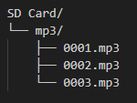

# 🕌 Auto Tarhim & Bel Elektrik IoT (ESP8266)
Proyek *Internet of Things* (IoT) berbasis mikrokontroler NodeMCU ESP8266 untuk mengotomatisasi pemutaran audio Tarhim sebelum waktu salat dan membunyikan Bel Elektrik sesuai jadwal.Sistem ini dilengkapi dengan Web Dashboard UI yang modern dan responsif untuk memudahkan pengaturan tanpa harus mengubah kode program.

## 📖 Deskripsi
Alat ini mengambil data jadwal salat secara *real-time* dari API MyQuran.Menjelang waktu salat (bisa diatur berapa menit sebelumnya), alat akan otomatis menyalakan Amplifier (via Relay) dan memutar file MP3 Tarhim dari modul DFPlayer Mini.Selain itu, terdapat fitur Bel Elektrik otomatis yang sangat cocok untuk jadwal masuk sekolah atau kegiatan pondok pesantren. 
Semua pengaturan disimpan di dalam memori internal ESP8266 menggunakan sistem *LittleFS*, sehingga data tidak akan hilang ketika listrik padam.

## ✨ Fitur Utama

- **📡 Sinkronisasi Waktu & Jadwal Otomatis**: Mendapatkan waktu via NTP Server dan jadwal salat harian dari API MyQuran.
- **📻 Auto Tarhim**: Mengaktifkan relay amplifier dan memutar audio dari SD Card secara otomatis sebelum adzan.Pilihan file MP3 dan durasi hitung mundur dapat dikustomisasi.
- **🔔 Auto Bel Elektrik**: Menyediakan hingga 15 slot jadwal bel elektrik.Bisa diatur waktu berbunyi, jumlah dering, dan durasi per dering.
- **💻 Web Dashboard (Dark Mode)**: Antarmuka web yang modern, responsif, dan mendukung *tabbing* (Tab Tarhim & Tab Bel) untuk kemudahan manajemen.
- **📱 Remote Manual**: Tombol *bypass* di web UI untuk menyalakan/mematikan Ampli secara manual, serta tombol "Tahan" untuk membunyikan Bel secara manual dengan fitur *Failsafe* (anti-hang).
- **📺 LCD 16x2 dengan 3 Mode**: Tombol fisik untuk mengganti tampilan layar LCD: 
  -Mode 0: Jam & Hitung Mundur Tarhim.
  -Mode 1: Jam & Hitung Mundur Bel Selanjutnya.
  -Mode 2: Informasi Alamat IP.

## 🛠️ Kebutuhan Hardware

1. NodeMCU ESP8266 (atau Wemos D1 Mini).
2. Modul DFPlayer Mini + MicroSD Card (berisi file MP3).
3. Modul Relay 2 Channel (Active HIGH).
4. LCD 16x2 + Modul I2C.
5. Tombol Push Button (Tactile Switch).
6. Amplifier & Speaker (Terkoneksi ke Relay 1).
7. Bel Elektrik (Terkoneksi ke Relay 2).

## 📌 Skema Pin (Wiring)

Berikut adalah pemetaan pin berdasarkan kode program:

| Komponen | Pin Modul | Pin NodeMCU ESP8266 | Keterangan |
| :--- | :--- | :--- | :--- |
| **DFPlayer Mini** | RX | `D1` |Menggunakan SoftwareSerial |
| | TX | `D2` |Menggunakan SoftwareSerial |
| **LCD 16x2 I2C** | SDA | `D6` |Dideklarasikan via `Wire.begin(D6, D5)` |
| | SCL | `D5` |Dideklarasikan via `Wire.begin(D6, D5)` |
| **Relay Ampli** | IN 1 | `D8` |Active HIGH |
| **Relay Bel** | IN 2 | `D7` |Active HIGH |
| **Tombol LCD** | Kaki 1 | `D4` |Menggunakan internal PULLUP (`INPUT_PULLUP`) |
| | Kaki 2 | `GND` |Ditekan menyambung ke Ground |

*Catatan: Pastikan VCC dan GND setiap komponen terhubung dengan baik. Untuk DFPlayer, sangat disarankan menggunakan resistor 1K pada jalur RX untuk menghilangkan noise (mendesis).*

## 📚 Library yang Dibutuhkan
Pastikan Anda telah menginstal pustaka (*library*) berikut melalui **Arduino Library Manager** sebelum melakukan kompilasi:
- `ESP8266WiFi`, `ESP8266WebServer`, `ESP8266HTTPClient` (Bawaan core ESP8266).
- `NTPClient` (oleh Fabrice Weinberg).
- `LiquidCrystal_I2C` (oleh Frank de Brabander).
- `DFRobotDFPlayerMini` (oleh DFRobot).
- `ArduinoJson` (oleh Benoit Blanchon - **Gunakan Versi 6.x**).

## 🚀 Cara Instalasi

1. Unduh atau *clone repository* ini.
2. Buka file `.ino` menggunakan **Arduino IDE**.
3. Ubah konfigurasi WiFi pada baris kode berikut agar sesuai dengan jaringan Anda:
   ```cpp
   const char* ssid     = "NAMA_WIFI_ANDA";
   const char* password = "PASSWORD_WIFI_ANDA";
4. isi file audio pada kartu memory , masukan file audio di dalam folder **mp3** dan penaaan fila audio dengan format 0001.mp3 dst
5. struktur folder seperti ini 